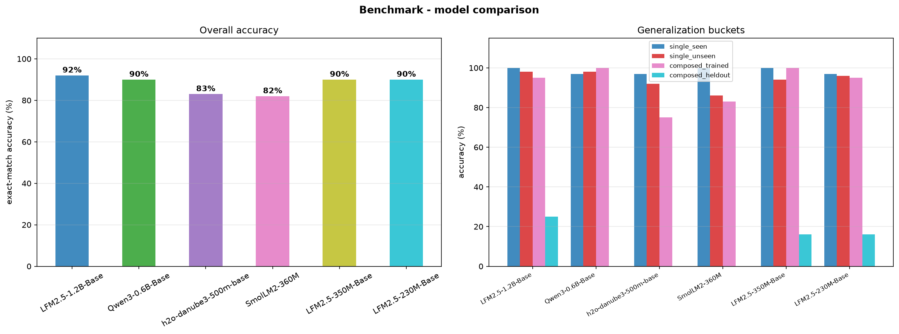

# lfm-train

Benchmarking small (<=1.2B parameter) base language models, fine-tuned for a
domain-specific instruction -> rewrite task, on a single consumer GPU.

## Disclaimer

> This project was co-authored with an LLM agent (Anthropic).
> The code, the experiment design, and this writeup were produced through human-directed agentic pair programming.

## Published models

Fine-tuned on the PromQL domain and published to the Hugging Face Hub (each includes a merged fp16 model and a Q4_K_M GGUF):

- [lazos/lfm2.5-350m-promql](https://huggingface.co/lazos/lfm2.5-350m-promql) - flagship; LFM Open License v1.0.
- [lazos/qwen3-0.6b-promql](https://huggingface.co/lazos/qwen3-0.6b-promql) - strongest license-clean model; Apache-2.0.

## Goal

Can a small base model, fine-tuned cheaply on commodity hardware, learn a narrow domain task well enough to be useful - and how do model size, architecture, and license trade off when you do that?

This repo is a reproducible harness to answer that for one concrete task and six models, with honest, held-out evaluation.

The reference domain is **PromQL query optimization**.

Given an instruction and a PromQL expression, rewrite the expression (push label filters into selectors, swap in recording rules, downsample long ranges, deduplicate Thanos replicas, etc.).

## What we found

- **Single-transform generalization is essentially free** and independent of model size and architecture: every model rewrites correctly on *held-out* vocabulary it never saw in training (86-98% exact match).
- **Composition is a wall.** Asked to apply two transforms at once for a combination it was never trained on, every model collapses (0-25%), while scoring 75-100% on the same composition once that *type* appears in training. This holds across two model families and a 5x size range, so it is a property of the task, not of any one model.

Full numbers: **[BENCHMARK.md](BENCHMARK.md)**. 

Mechanism and experiments:
[docs/compositional-generalization.md](docs/compositional-generalization.md).



## How it works

Three clean layers:

1. **Domain** (`domains/<domain>.yaml`) - the entire task as declarative data: a vocabulary (with held-out train/eval splits) and Jinja2 transformation patterns, plus the task framing (system prompt, input label). No task examples are hardcoded in Python.
2. **Generator** (`uv run gen-dataset`) - a domain-agnostic engine renders the spec into `data/<domain>_{train,eval}.jsonl` and a `_prompt.json` sidecar. It samples held-out vocabulary for eval, dedups, and audits for train/eval leakage.
3. **Model configs** (`configs/*.yaml`) - model + LoRA + training hyperparameters only. Domain-agnostic and reusable; `base.yaml` holds shared defaults.

Training, evaluation, and inference pick a domain at the CLI (`--data data/<domain>`).
The prompt travels with the data and is also saved next to each trained adapter, so inference always reproduces the exact training prompt.

### Honest evaluation

Train and eval vocabulary are **disjoint** (held-out metrics, jobs, namespaces, ...), so eval accuracy reflects learned transformations, not memorized tokens. Every eval example carries a `bucket` label. The four buckets, in increasing difficulty:

- **`single_seen`** - one transform, using vocabulary the model *did* see in training. Upper-bound sanity check (memorization allowed). If this is high but `single_unseen` is low, the model memorized tokens instead of learning the transform.
- **`single_unseen`** - one transform, on held-out vocabulary. The real single-transform generalization number: same operation, metrics/jobs never seen in training.
- **`composed_trained`** - two transforms applied in a single rewrite, where this *composition type* was trained (on different vocabulary). Tests whether a learned composition transfers to new vocabulary.
- **`composed_heldout`** - two transforms in a single rewrite, where this *composition type* was **never** trained - only the individual transforms were seen separately. This is true compositional generalization: combining known operations into a combination never demonstrated.

The headline result is the gap between the last two: `composed_trained` lands at 75-100%, while `composed_heldout` collapses to 0-25% - the same models, the same two operations, differing only in whether the *combination* appeared in training. Per-model numbers in [BENCHMARK.md](BENCHMARK.md).

## Quickstart

Requirements: an NVIDIA GPU (developed on an RTX 3060 Ti, 8GB), Python 3.12, and [`uv`](https://docs.astral.sh/uv/). Everything below runs locally; no LLM agent needed.

```sh
# 1. install (CUDA training stack)
uv sync --extra gpu          # or: make install

# 2. generate the dataset from the domain spec
uv run gen-dataset           # or: make dataset

# 3a. train one model
uv run train --config configs/lfm2.5_350m.yaml --data data/promql

# 3b. or train + evaluate all six models and write outputs/benchmark.json + chart
uv run benchmark \
  --configs configs/lfm2.5_1.2b.yaml configs/qwen3_0.6b.yaml \
            configs/danube3_500m.yaml configs/smollm2_360m.yaml \
            configs/lfm2.5_350m.yaml configs/lfm2.5_230m.yaml \
  --data data/promql --output outputs/benchmark.json
# or simply: make benchmark

# 4. evaluate a trained adapter on its own
uv run evaluate --finetuned outputs/lfm2.5-350m/lora_adapter --data data/promql

# 5. try it interactively (REPL), or batch with --prompts file.json
uv run infer outputs/lfm2.5-350m/lora_adapter
```

To prompt a published model directly, see:
- [examples/prompt_transformers.py](examples/prompt_transformers.py) (fp16)
- [examples/prompt_gguf.py](examples/prompt_gguf.py) (Q4_K_M GGUF).

Both go through the chat template - the one rule for prompting these models correctly.

Each training run writes to `outputs/<model>/`: a LoRA adapter (`lora_adapter/`), a merged fp16 model (`merged_16bit/`), a Q4_K_M GGUF (`gguf_gguf/`), training metrics, and plots.

## Adding a domain

1. Write `domains/<name>.yaml` (vocabulary + patterns + prompt).
2. `uv run gen-dataset --domain <name>` -> `data/<name>_*`.
3. Train/benchmark with `--data data/<name>`.

No Python changes. The model configs are unchanged - they are domain-agnostic.

## Models

| Model | Size | License |
|---|---|---|
| LiquidAI/LFM2.5-1.2B-Base | 1.2B | LFM Open License v1.0 |
| LiquidAI/LFM2.5-350M-Base | 350M | LFM Open License v1.0 |
| LiquidAI/LFM2.5-230M-Base | 230M | LFM Open License v1.0 |
| Qwen/Qwen3-0.6B-Base | 0.6B | Apache-2.0 |
| h2oai/h2o-danube3-500m-base | 0.5B | Apache-2.0 |
| HuggingFaceTB/SmolLM2-360M | 360M | Apache-2.0 |

The LFM Open License permits free use and redistribution (including fine-tuned
derivatives) for entities under $10M annual revenue; above that, a commercial
license from Liquid AI is required. The Apache-2.0 models have no such restriction.

## Publishing a model

Built and published locally (the GPU and HF token live on your machine):

```sh
export HF_TOKEN=...   # never commit this
uv run publish outputs/lfm2.5-350m/merged_16bit <user>/lfm2.5-350m-promql \
  --gguf outputs/lfm2.5-350m/gguf_gguf
uv run publish outputs/qwen3-0.6b/merged_16bit  <user>/qwen3-0.6b-promql \
  --gguf outputs/qwen3-0.6b/gguf_gguf
```

`publish` derives the correct license metadata from the base model and generates a model card. The published GGUF runs in any GGUF runtime (llama.cpp, Ollama, LM Studio); the merged fp16 model runs with `transformers`.

## Repo layout

```
configs/                 model + training configs (domain-agnostic)
domains/                 domain specs (vocab + patterns + prompt) - edit to add a domain
examples/                how to prompt a published model (transformers + GGUF)
src/lfm_train/
  data/engine.py         domain-agnostic dataset generator
  data/generate.py       gen-dataset CLI
  dataset.py             prompt formatting, chat-template / eos fixes
  trainer.py             QLoRA SFT
  evaluate.py            single-model evaluation
  benchmark.py           train + eval all models, tabulate, chart
  infer.py               REPL / batch inference
  plot.py                training + benchmark charts
  publish.py             push a model to the Hugging Face Hub
docs/                    findings writeup + assets
BENCHMARK.md             results
```

## License

Code in this repository: see [LICENSE](LICENSE).

Fine-tuned model weights inherit the license of their respective base model (see the table above).
